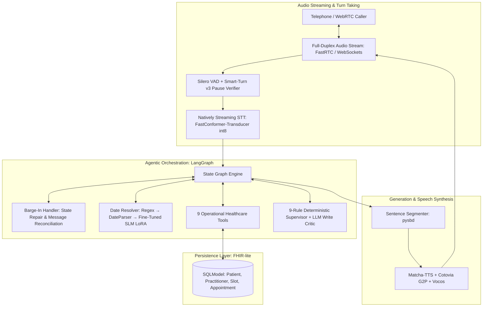

# Loaira — Primary-Care Healthcare Voice Agent

Production-grade conversational voice agent engineered for public healthcare appointment management. "Loaira" operates in real time with full-duplex audio in Galician and Spanish, managing patient verification, real availability queries, appointment scheduling, cancellations, and clinical attendance certificates over synthetic FHIR-compliant records.

Delivered and evaluated as a Master's Thesis project (MSc in Artificial Intelligence, Universidade de Santiago de Compostela).

---

## System Architecture

---

## Key Capabilities & Engineering Features

### 1. Bilingual & Native Regional Support
- Operates primarily in Galician with seamless dynamic switching to Spanish based on user preference or registered patient metadata.
- Preserves dialectal nuances and avoids phonological drift through a dedicated phonemic front-end.

### 2. Operational Healthcare Workflows (9 Tools)
Built on a relational database adhering to a FHIR-lite schema (`Patient`, `Practitioner`, `Slot`, `Appointment`):
1. **Patient Identity Verification:** Multi-factor verification (phone number + birthdate).
2. **Free Slot Resolution:** Real-time agenda search with natural-language date and shift filtering.
3. **Appointment Booking:** Slot reservation with explicit, deterministic confirmation steps.
4. **Appointment Listing:** Queries upcoming and historical visits.
5. **Appointment Cancellation:** Safe cancellation with audit trail.
6. **Home Visit Scheduling:** Protocolized home assistance requests.
7. **Home Visit Slot Search:** Availability checks for mobile care teams.
8. **Callback Requests:** Escalation pathway for human triage when automated paths fail.
9. **Attendance Certificates:** Automatic generation and email dispatch of signed PDF clinical attendance documents.

### 3. Latency Optimization & Overlapped Streaming
- **Token-to-Sentence Overlap:** LLM token streams are segmented into complete grammatical sentences (`pysbd`) and dispatched to TTS in parallel. The first audio chunk is audible to the caller before the LLM completes generation.
- **Conversational Fillers:** Context-aware spoken fillers mask database queries and write-critic validation roundtrips.
- **Turn-Taking Detection:** Combines Silero VAD with Smart-Turn v3 end-of-turn classification to prevent premature cut-offs.

### 4. Resilient Barge-In & State Repair
- If the caller interrupts the agent mid-utterance, the audio playback cuts immediately.
- The LangGraph state graph reconciles the spoken fragment with the planned generation using synthetic tool-message repair, ensuring context integrity without conversational desynchronization.

### 5. Multi-Layer Safety Supervisor
- **Deterministic Rules (R1–R7, R-LOOP, R-DUP):** Strict invariants preventing repeated tool calls, unauthorized database writes, and infinite conversational loops.
- **LLM Write Critic:** Asynchronous safety inspector evaluating destructive database mutations before commit, with full audit logging.

### 6. Robust Spoken Date Resolution
- Spoken temporal expressions are parsed through a staged pipeline:
  `Deterministic Regex → dateparser → Fine-Tuned SLM (Qwen3-0.6B LoRA)`
  trained against phonetic transcriptions subject to acoustic STT noise.

### 7. Multi-Provider LLM Cascade
- Primary inference through Groq (`gpt-oss-120b`) with sub-second time-to-first-token.
- Automatic in-flight failover across Cerebras, NVIDIA NIM, and self-hosted vLLM backends with `RunnableWithFallbacks` tool rebinding to survive upstream rate limits.

---

## Speech Infrastructure

The agent integrates with a companion natively streaming speech stack (`gl-speech-streaming`) engineered specifically for Galician, deployed entirely on CPU hardware (Oracle Ampere A1 aarch64 VM) at zero cloud cost.

| Metric | Measured Value | Benchmark Context |
|---|---|---|
| **Perceived Turn Latency (p50)** | **691 ms** | STT final hypothesis + TTS first audio frame (target: < 1.5 s) |
| **TTS Time to First Audio (TTFA)** | **527 ms** | CPU inference across 8 / 16 / 22.05 / 24 kHz formats |
| **STT Architecture** | FastConformer-Transducer | Frame-synchronous, cache-aware streaming (ONNX int8 on CPU) |
| **TTS Architecture** | Matcha-TTS + Vocos | Non-autoregressive flow-matching chunked by clause |
| **Phonemic Front-End** | Cotovia G2P (SAMPA) | Natively compiled aarch64 binary; eliminates Portuguese/Spanish drift |
| **STT Accuracy (560 ms chunk)** | **12.8% WER** (Broadcast) / **24.3% WER** (Spontaneous) | Outperforms offline reference models (whisper-turbo-gl: 26.7%) |

---

## Technical Stack

| Layer | Technologies |
|---|---|
| **Agent Orchestration** | LangGraph, LangChain Core |
| **Voice Streaming & WebRTC** | FastRTC, WebSockets, Pipecat |
| **Speech Processing** | FastConformer-Transducer, Matcha-TTS, Vocos, Sherpa-ONNX, Silero VAD |
| **Language & Parsing** | Qwen3-0.6B (LoRA fine-tuned), Groq, pysbd, dateparser |
| **Backend & Persistence** | Python 3.11+, FastAPI, SQLModel, SQLite / PostgreSQL |
| **Infrastructure & CI** | Docker, uv, Oracle Ampere A1 (aarch64 Linux) |

---

**Note:** All patient records, clinical practitioner schedules, and telephone metadata used in this repository are synthetic.
