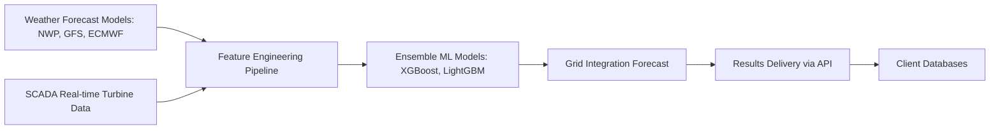

# Wind Energy Production Forecasting

## System Architecture

    

```mermaid
graph LR
    A[Weather Forecast Models: NWP, GFS, ECMWF] --> B[Feature Engineering Pipeline]
    C[SCADA Real-time Turbine Data] --> B
    B --> D[Ensemble ML Models: XGBoost, LightGBM]
    D --> E[Grid Integration Forecast]
    E --> F[Results Delivery via API]
    F --> G[Client Databases]
```

## Overview

This project provides an operational forecasting pipeline for wind energy production, synthesizing numerical meteorological predictions, high-frequency turbine SCADA data, and gradient-boosted ensembles. Designed for power generation forecasting, grid commitment planning, and maintenance coordination.

### Workflow
1. **Data Ingestion:** Automated ingestion of gridded weather forecasts (GRIB / NetCDF) and turbine telemetry (SCADA active power, pitch angle, anemometer readings).
2. **Feature Engineering:** Extraction of atmospheric stability indicators, directional shear, aerodynamic wake interactions, and terrain roughness factors.
3. **Model Training & Validation:** Ensemble regressors (XGBoost, LightGBM) optimized under expanding-window time-series cross-validation to prevent temporal data leakage.
4. **Programmatic Delivery:** Forecast vectors published directly to client operational databases through authenticated API endpoints.

## Operational Impact

- **Operational Challenge:** Non-linear wind variability complicates energy market bidding and maintenance scheduling.
- **Engineered Solution:** Accurate intra-day and day-ahead production curve predictions mitigate imbalance penalties and optimize dispatch schedules.
- **Application:** Asset operations, dispatch planning, and grid compliance reporting.

## Technical Stack

- **Machine Learning:** scikit-learn, XGBoost, LightGBM
- **Data Engineering:** pandas, numpy, pyarrow
- **GIS & Terrain Processing:** QGIS, rasterio
- **Formats & Delivery:** GRIB2, NetCDF, Parquet, REST API endpoints

## Results & Delivery

Forecast outputs are delivered directly to downstream data stores and energy management systems via API. No proprietary turbine calibration curves or non-public SCADA logs are included in this public compendium.
